# 🎭 Web WireMock

> A beautiful web UI for managing [WireMock](https://wiremock.org/) stubs —
> designed for testers and developers who want full control without touching JSON files manually.


---

## ✨ Features

- 📁 **Tree view** — stubs grouped by service and path for easy navigation
- 🧙 **Step-by-step stub wizard** — create stubs in 5 guided steps
- ✏️ **Full stub editor** — edit request, response, query params, headers and proxy options
- ▶️ **Run Test** — fire a real HTTP request to WireMock directly from the UI and see the response
- 📋 **Request log** — browse all logged requests with headers, body, timing and match status
- 🎬 **Scenarios** — manage stateful behaviour through visual state machine chains
- 💾 **Profiles** — save, load, export and import stub sets as portable JSON files
- 🔀 **Merge / Replace** — apply a profile on top of existing stubs (merge) or reset completely (replace)
- 📥 **OpenAPI import** — generate stubs automatically from an OpenAPI spec
- 🔍 **Quick search** — filter stubs by client, path or full-text

---

## 📸 Screenshots

### Stubs — main page

Tree view with grouping by service, HTTP method badges, priority and stub detail panel.


---

### Run Test

Execute a real request to WireMock right from the stub card and instantly see status, headers and body.

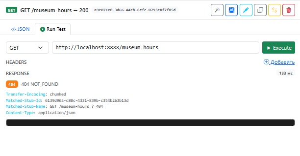

---

### Creating a stub — Step 1: Request

Set stub name, HTTP method, URL match type and optionally bind to a specific JWT client.

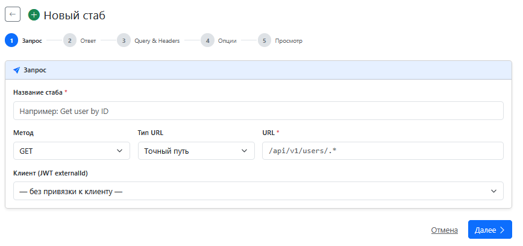

---

### Editing a stub

#### Step 1 · Request
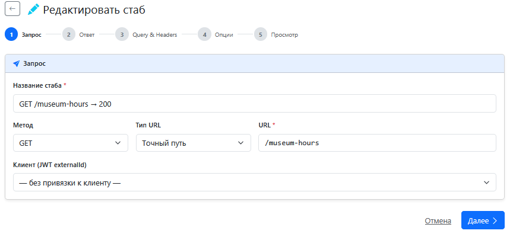

#### Step 2 · Response
Configure HTTP status, Content-Type, response delay and body (plain JSON or Handlebars template).

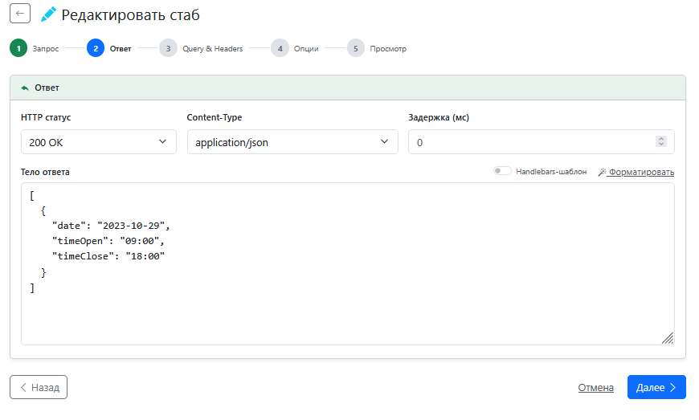

#### Step 3 · Query Parameters & Headers
Add request matching conditions on query params and incoming headers.

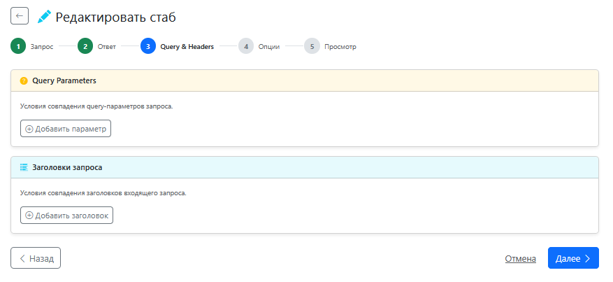

#### Step 4 · Options — Proxy stub
Optionally auto-create a proxy stub for the same URL that forwards requests without JWT matching.

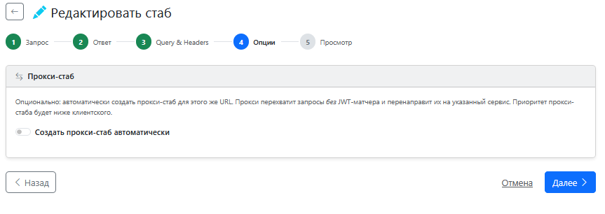

#### Step 5 · Preview
Review the final WireMock JSON before saving.

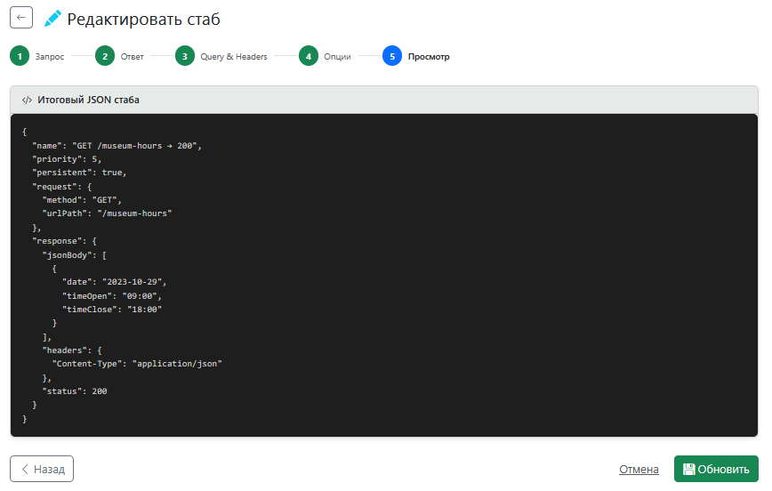

---

### Request Log

Full request history: URL, method, match status, timing, headers, body, cookies and matched stub link.


---

### Profiles

Save the current set of stubs as a named profile, then restore it later with one click.
Export a profile as JSON and share it with teammates — they import it in seconds.

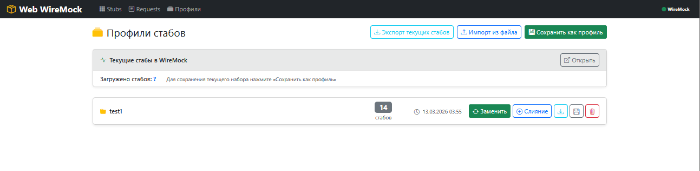

| Mode | Behavior |
|------|----------|
| **Replace** | Delete all existing stubs and load the profile. Best for local dev. |
| **Merge** | Add profile stubs on top of existing ones. Best for shared k8s environments. |

---

### 🎬 Scenarios

Scenarios let you simulate **stateful behaviour** — the same URL returns different responses
depending on the current state. Perfect for testing CRUD flows, retry logic
and eventual consistency without a real database.

Each scenario is a chain of steps: `Started → Step 2 → Step 3 → ...`
Each step is a regular WireMock stub that fires only when the scenario is in the right state.

**UI capabilities:**
- Visual step chain with active state indicator (auto-refreshes via polling)
- `←` `→` buttons to navigate step by step
- Manual state override via dropdown
- Reset a single scenario or all scenarios to `Started`

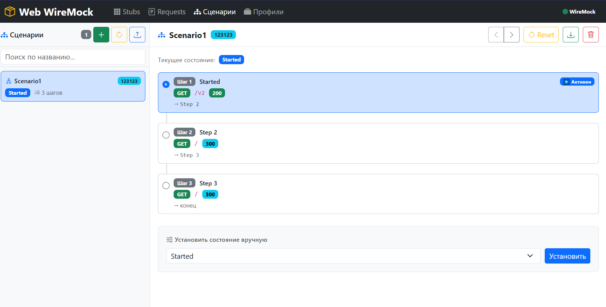

- Bind to a specific `JWT externalId` — one tester's scenario won't interfere with another's
- `GLOBAL` mode — scenario without client binding, visible to all

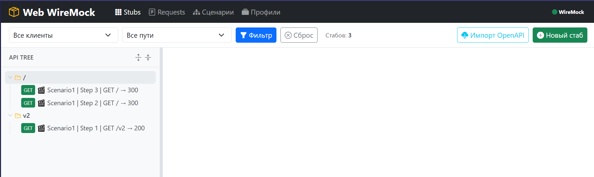

- Export and import scenarios as JSON (Merge / Replace modes)

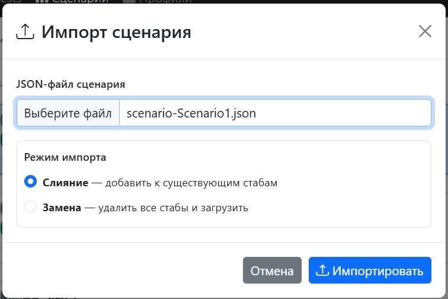

- 3-step creation wizard: create new stubs or clone existing ones

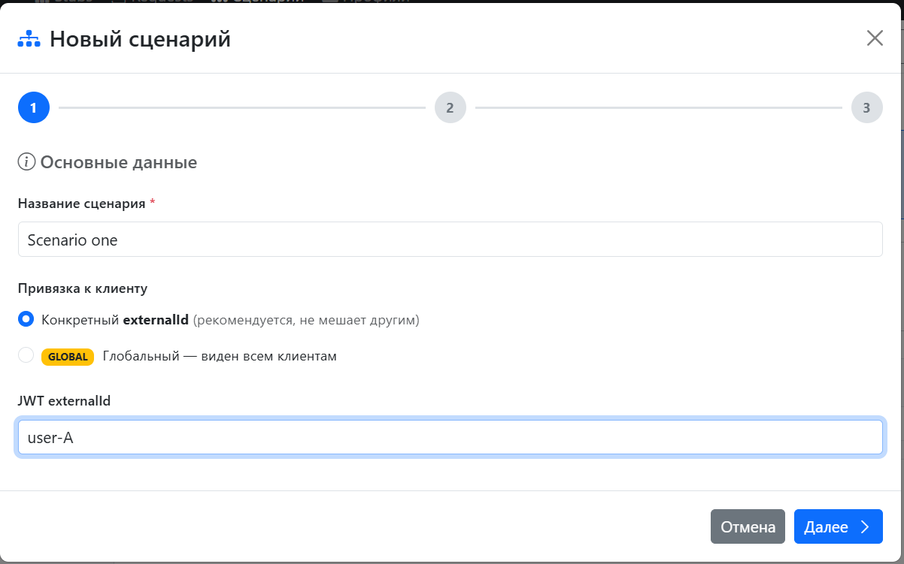
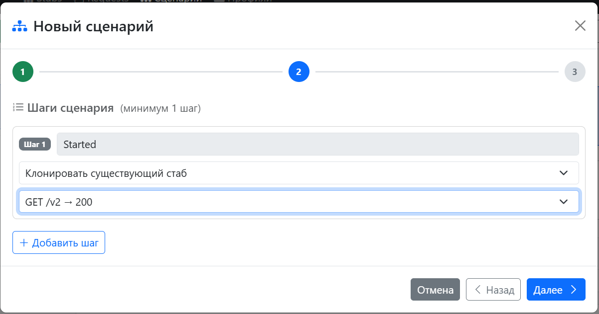
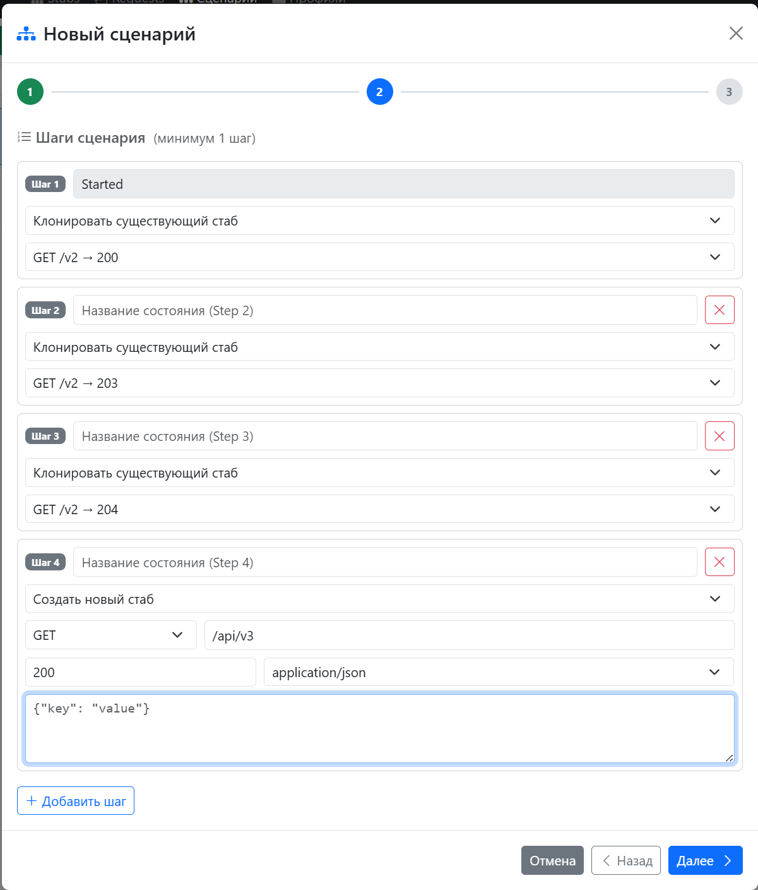
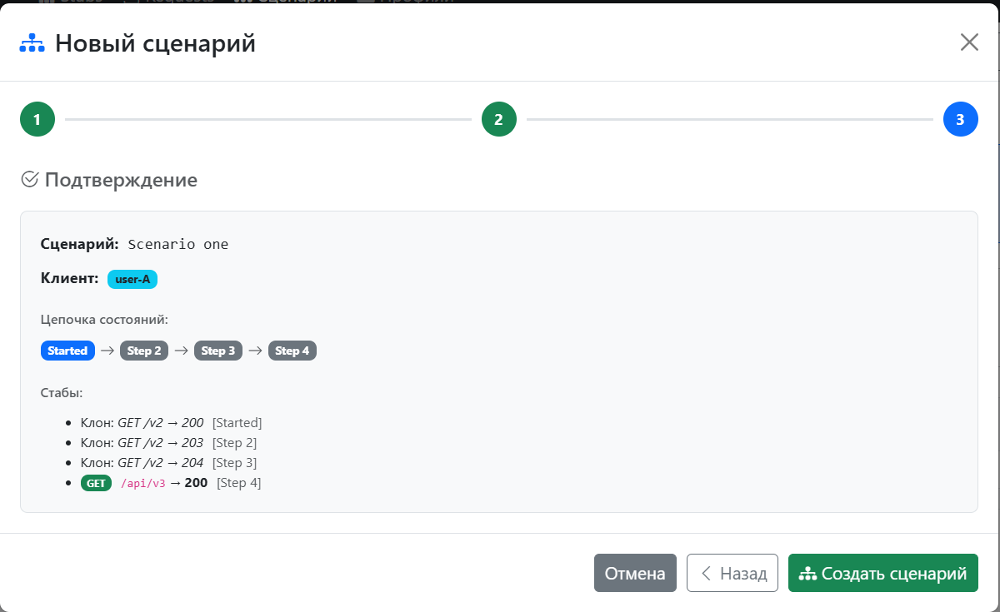

---

## 🚀 Quick Start

### Docker Compose

```yaml
services:
  wiremock:
    image: wiremock/wiremock:latest
    ports:
      - "8888:8080"

  web-wiremock:
    image: web-wiremock:latest
    ports:
      - "8080:8080"
    environment:
      INTEGRATION_WIREMOCK_HOST: http://wiremock:8080
      INTEGRATION_PROFILES_DIR: /data/profiles
    volumes:
      - ./wiremock/profiles:/data/profiles
```

## Configuration

| Property                  | Default               | Description                  |
| ------------------------- | --------------------- | ---------------------------- |
| integration.wiremock-host | http://localhost:8888 | WireMock base URL            |
| integration.profiles-dir  | ./wiremock/profiles   | Directory for saved profiles |

## 🏗️ Tech Stack
Layer	Technology
Layer	Technology
Backend	Java 21, Spring Boot 3, OpenFeign
Frontend	Thymeleaf, Bootstrap 5, Bootstrap Icons
Mock engine	WireMock 3
Build	Maven

## 🤝 Contributing
Pull requests are welcome. For major changes please open an issue first.

## ☕ Support the project
If Web WireMock saves you time — consider supporting further development:
[boosty.to/malexple](https://boosty.to/malexple)